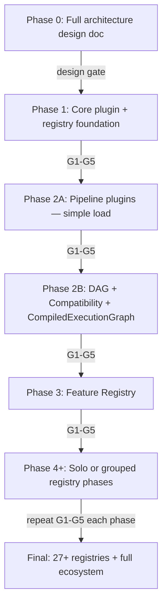
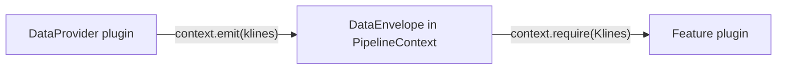
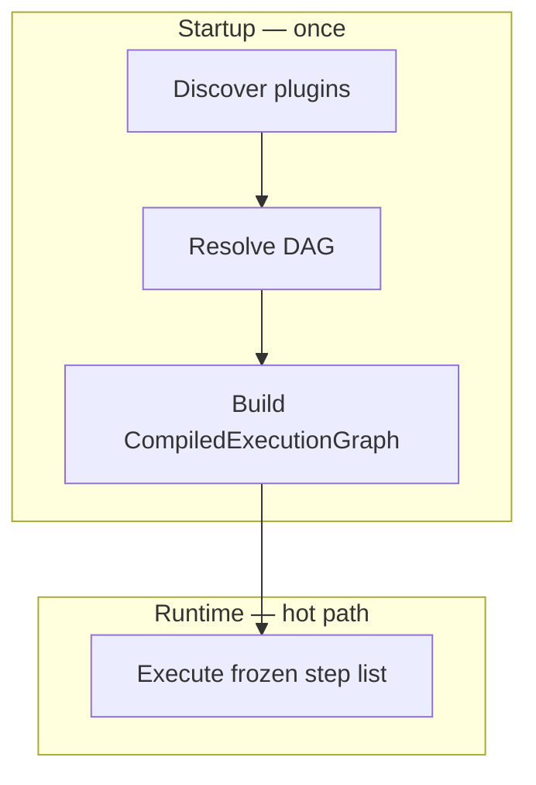
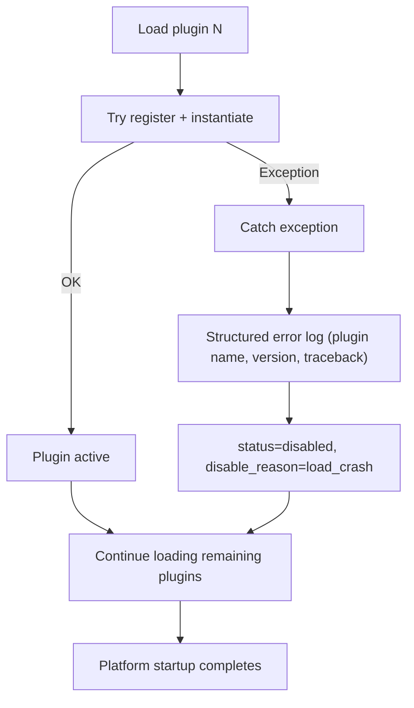
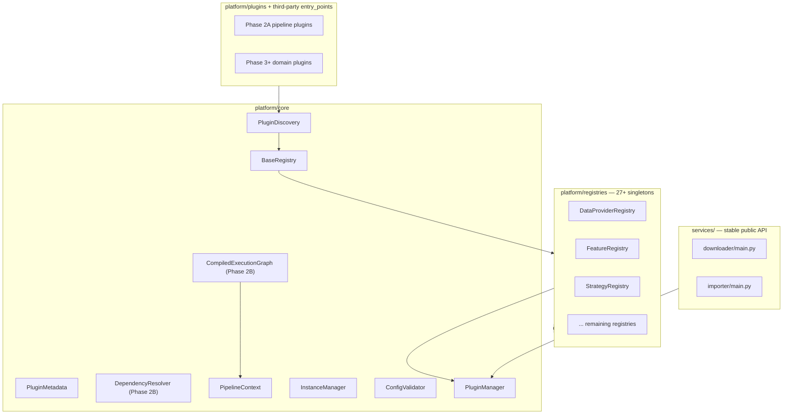
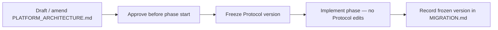
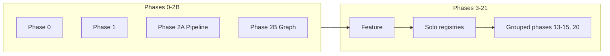

# Registry & Plugin Architecture Plan

## Governing Rules

### Full Scope Commitment

The system **MUST eventually** implement the complete architecture:

- All **27+ registries** (see [Complete Registry Map](#complete-registry-map))
- Full **plugin ecosystem** (discovery, metadata, compatibility, composability)
- **Trading + RL + backtesting** platform capabilities

**Nothing in scope is permanently removed or simplified.** Stubs and deferred work are temporary; every registry in the spec will be implemented.

### Critical Execution Rule — Strict Phase Gating

**You are NOT allowed to proceed to the next phase until ALL gates pass:**

| Gate | Requirement |
|------|-------------|
| G1 — Implementation | Current phase deliverables are fully implemented |
| G2 — Tests | All new + existing tests pass (`pytest` green) |
| G3 — Backward compatibility | Legacy `services/` entry points, Docker CMD, `config/config.yaml` without `plugins:` section behave identically |
| G4 — Architecture stability | No known breaking changes to `platform/core/` APIs introduced in current phase |
| G5 — Documentation | Phase deliverables documented in `docs/MIGRATION.md` with rollback steps |

Each phase ends with an explicit **Phase Exit Checklist** (see per-phase sections). No exceptions.

### Design Principle

> **Build the full map first, but walk it step by step.**

| Upfront (design) | Incremental (implementation) |
|------------------|------------------------------|
| All 27+ registry Protocol contracts documented | Solo or **grouped** registry phases (after Phase 2B) |
| Complete plugin metadata schema defined | Fields used as each phase needs them |
| `PipelineContext` / `DataEnvelope` runtime data contract | Implemented Phase 2B (graph) + used from Phase 3 |
| `CompiledExecutionGraph` spec (startup-only, zero runtime lookup) | Implemented Phase 2B |
| Full phase roadmap with dependencies | Code written only for current phase |
| Entry-point group naming convention | Entry points registered per phase |
| Composability patterns (CompositeReward, etc.) specified | Composite helpers added with their registry |

### Phase Execution Rule

Each phase introduces **exactly ONE major system capability**, is fully testable, is backward compatible, and does **NOT depend on unimplemented future phases**.

**Grouped phases exception:** Up to **3 registries** may ship in one phase **only when** they share the same infrastructure and are meaningless in isolation (e.g. Notification + Monitoring + Visualization). Document the grouping rationale in `MIGRATION.md` before the phase starts. Large registries (Strategy, Backtesting, Live Trading) always remain **solo phases**.

### Forbidden Behavior

| Forbidden | Reason |
|-----------|--------|
| Multiple **unrelated** registries in one phase | Grouped phases limited to 3 co-dependent registries with documented rationale |
| DAG resolver or CompatibilityChecker before Phase 2B | Phase 2A is simple load only; graph is Phase 2B |
| Build full dependency graph before Phase 2B | Phase 1 = foundation; Phase 2A = pipeline plugins without DAG |
| Registry lookup or discovery at runtime (per tick) | Discovery/DAG only at startup; runtime uses `CompiledExecutionGraph` |
| Build plugin marketplace before final phases | Design hooks only until Phase 23+ |
| Couple phases (Phase N code requiring Phase N+2 features) | Each phase must stand alone |
| Skip validation gates | Hard stop — no merge to next phase |
| Permanently stub a registry instead of implementing it | Stubs are Phase 0 design only until that registry's phase |
| Rewrite existing `services/` pipeline logic | Adapter/wrap only in Phase 2A — **internal refactor for testability is allowed** |
| Change a Protocol mid-phase | Protocol for phase N must be frozen before phase N starts; no edits during implementation |

### Required Flow



---

## Plugin Lifecycle & Reliability

Cross-cutting rules for versioning, failure handling, status semantics, **runtime data flow**, **startup vs runtime performance**, and **instance lifecycle**. **Designed in Phase 0; implemented incrementally from Phase 1.**

### Plugin Versioning (SemVer)

Third-party plugins require strict, machine-checkable versioning. `PluginMetadata` **must** include:

| Field | Type | Required | Purpose |
|-------|------|----------|---------|
| `version` | `str` (SemVer) | **Yes** | Plugin release version (e.g. `1.2.3`, `2.0.0-beta.1`) |
| `platform_version_compatibility` | `str` (semver specifier) | **Yes** | Range of compatible platform versions (e.g. `>=1.0.0,<2.0.0`) |

Additional cross-component version fields (optional until relevant phase):

| Field | Example | Activated |
|-------|---------|-----------|
| `compatible_dataset_versions` | `>=1.0.0` | Phase 2+ |
| `compatible_feature_versions` | `>=0.1.0` | Phase 3+ |
| `dependencies[].version` | `my-plugin>=2.0.0,<3.0.0` | Phase 2B+ |

**Validation rules (Phase 1 design; Phase 2B enforcement):**

- `version` validated against SemVer via `packaging.version.Version`
- `platform_version_compatibility` parsed as `packaging.specifiers.SpecifierSet`
- At load time: if `PLATFORM_VERSION` ∉ `platform_version_compatibility` → plugin **registered** but **not instantiated**; status set to `disabled`, `disable_reason=incompatible_version`
- Third-party plugins **must not** load if version contract fails — no silent fallback

```python
# platform/core/plugin.py (conceptual)
class PluginMetadata(BaseModel):
    name: str
    version: str                          # SemVer, required
    platform_version_compatibility: str   # e.g. ">=1.0.0,<2.0.0", required
    lifecycle: PluginLifecycle          # singleton | transient | scoped
    # ... remaining spec fields
```

### Instance Lifecycle (Stateful vs Stateless)

Plugins differ in state requirements. `PluginMetadata` includes **`lifecycle`**:

| Value | Instantiation | Use case | Registry behavior |
|-------|---------------|----------|-------------------|
| `singleton` | Once at startup; reused forever | DB connection pool, config service | Thread-safe instance cache; explicit `shutdown()` on platform stop |
| `transient` | New instance per `get()` call | Parser, pure transforms | No cache; GC after use |
| `scoped` | One instance per pipeline/trading run | Portfolio, Replay Buffer, Strategy session | Cache keyed by `run_id`; cleared when run ends |

```python
class PluginLifecycle(str, Enum):
    SINGLETON = "singleton"
    TRANSIENT = "transient"
    SCOPED = "scoped"
```

**Implementation phases:**

- **Phase 1:** `lifecycle` field in metadata; default `transient`; registry is factory-only (no long-lived cache)
- **Phase 2B:** `InstanceManager` — singleton cache with lock, scoped cache with run lifecycle, memory cleanup hooks
- **Phase 2B tests:** verify scoped instances do not leak across runs; singleton is shared

**Thread-safety:** `BaseRegistry.get()` for `singleton` uses double-checked locking; `scoped` uses per-run dict guarded by run context lock.

### Runtime Data Flow — PipelineContext & DataEnvelope

**Problem:** Structural DAG (load-order dependencies) ≠ runtime data flow. A Feature plugin needing DataProvider data must not couple directly to another plugin instance.

**Phase 0 design — implemented Phase 2B, used from Phase 3:**



| Type | Role |
|------|------|
| `DataEnvelope` | Typed, immutable data container (`type_key`, `payload`, `metadata`, `timestamp`) |
| `PipelineContext` | Per-run bag of envelopes; plugins **emit** and **require** by type — no direct plugin-to-plugin references |

```python
# platform/core/context.py (conceptual — Phase 2B)
class PipelineContext:
    def emit(self, envelope: DataEnvelope) -> None: ...
    def require(self, type_key: str) -> DataEnvelope: ...  # raises if missing
    def optional(self, type_key: str) -> DataEnvelope | None: ...
```

**Rules:**

- Plugins never call other plugins directly for data transfer
- Downstream plugins declare `input_types` in metadata; platform validates envelope availability before run
- `PipelineContext` is **scoped** (one per pipeline/trading run), not global
- Feature → Indicator chains pass `DataEnvelope` through context, not return-value coupling across plugin boundaries

### Startup vs Runtime Performance

**Critical for HFT and low-latency trading.** Phase 0 must specify:

| Phase | What happens | Cost |
|-------|--------------|------|
| **Startup** (once) | Discovery, metadata load, DAG resolution, compatibility checks, `CompiledExecutionGraph` build | Acceptable: seconds |
| **Runtime** (every tick/bar/request) | Execute pre-compiled graph only | **Zero** registry lookups, **zero** `importlib`, **zero** DAG traversal |



**`CompiledExecutionGraph` (Phase 2B):**

- Built once after all startup validation completes
- Frozen ordered list of `(plugin_ref, bound_method, lifecycle_handle)` tuples
- Hot path calls `graph.execute(context)` — direct function calls, no dict/registry access
- Graph rebuild **only** on config reload or plugin enable/disable (explicit admin action, not per tick)

```python
# platform/core/execution_graph.py (conceptual — Phase 2B)
class CompiledExecutionGraph:
    def __init__(self, steps: tuple[ExecutionStep, ...]) -> None: ...
    def execute(self, ctx: PipelineContext) -> None: ...  # no registry access
```

**Forbidden at runtime:** `importlib.metadata.entry_points()`, registry `get()` for pipeline steps, reflection, dynamic plugin discovery.

### Safe-Mode (Crash Isolation)

Trading systems must survive a single bad plugin. `PluginManager` implements **Safe-Mode**:

| Setting | Default | Description |
|---------|---------|-------------|
| `plugins.safe_mode` | `true` | When enabled, plugin load/instantiation failures do not crash the platform |
| `plugins.fail_fast` | `false` | When `safe_mode=false`, first plugin failure aborts startup (dev/CI only) |

**Safe-Mode behavior:**



- Failed plugins are **registered** (metadata retained) but **never instantiated**
- `PluginManager.get(name)` on a crash-disabled plugin raises `PluginUnavailableError` with `disable_reason` — never propagates the original crash
- Safe-Mode applies to: import errors, factory exceptions, config validation failures, compatibility failures
- **Phase 1:** Safe-Mode on single-plugin load via `PluginManager`
- **Phase 2B:** Safe-Mode extended to dependency-ordered batch load; dependents of a crash-disabled plugin also marked `disabled` with `disable_reason=dependency_unmet`

**Test strategy — crash plugin fixture:**

Integration tests for Safe-Mode use a dedicated **crash test plugin** (not production code):

```
tests/platform/fixtures/crash_plugin/
├── __init__.py          # PLUGIN_METADATA + factory
└── plugin.py            # class CrashPlugin: __init__ raises RuntimeError("Simulated crash")
```

| Test plugin variant | Purpose |
|---------------------|---------|
| `crash_plugin` | Basic Safe-Mode: single plugin crash → disabled → platform continues |
| `crash_plugin_dependent` (Phase 2B) | Depends on `crash_plugin`; verifies `dependency_unmet` cascade |

Entry point registered only under `[project.optional-dependencies.dev]` or loaded via `@register` in test setup — never shipped in production entry points.

```python
# tests/platform/fixtures/crash_plugin/plugin.py (conceptual)
class CrashPlugin:
    def __init__(self) -> None:
        raise RuntimeError("Simulated crash")
```

This avoids mocking import machinery and exercises the real `PluginManager` load path.

**Config example:**

```yaml
plugins:
  safe_mode: true          # production default
  fail_fast: false
  enabled:
    - binance_vision
    - clickhouse
```

### PluginStatus Semantics

Three author-facing statuses plus runtime disable reasons:

**Static status (`PluginStatus` — set by plugin author or config):**

| Status | Meaning |
|--------|---------|
| `enabled` | Plugin is eligible for load and execution |
| `disabled` | Plugin intentionally off (config, admin, marketplace) |
| `deprecated` | Plugin loads with warning; execution allowed until removal phase |

**Runtime disable reason (`disable_reason` — set by platform, not author):**

| Reason | Set when |
|--------|----------|
| `user_config` | Listed in `plugins.disabled` or `enabled` exclusion |
| `incompatible_version` | Fails `platform_version_compatibility` or cross-version matrix |
| `load_crash` | Safe-Mode caught an exception during import/instantiation |
| `dependency_unmet` | Required dependency disabled, failed, or missing (Phase 2B+) |
| `compatibility_rejected` | Incompatible combination detected by DAG resolver (Phase 2B+) |

**Critical rule — disabled plugins and the dependency graph (Phase 2B+):**

> Disabled plugins are **registered and visible** to the dependency resolver; their **factory is never called** and **methods are never executed**.

| Operation | `enabled` | `disabled` / crash-disabled |
|-----------|-----------|-------------------------------|
| Appear in `list_plugins()` | Yes | Yes |
| Metadata available for DAG | Yes | Yes |
| Satisfy dependency edge for other plugins | Yes (metadata only) | **Yes** — graph node exists; resolver knows the dependency declaration |
| Factory / `get()` instantiation | Yes | **No** — raises `PluginUnavailableError` |
| Method execution | Yes | **No** |
| Included in pipeline execution | Yes | **No** |

This ensures Phase 2B dependency graph integrity: a plugin that *depends on* a disabled plugin is itself marked `dependency_unmet` rather than failing with a missing-node error.

**`deprecated` handling:** loads normally; structured warning logged once at startup; included in dependency graph as `enabled`.

---

## Current State

The repo ([`crypto-pipeline`](pyproject.toml)) is a **working data ETL pipeline**:


- **No** registry, plugin loader, or entry points exist today.
- Components wired via static imports in [`services/downloader/main.py`](services/downloader/main.py) and [`services/importer/main.py`](services/importer/main.py).
- Config is YAML + Pydantic in [`services/shared/config.py`](services/shared/config.py).

---

## Complete Registry Map (Full Scope — Design Upfront)

All 27+ registries are **designed in Phase 0** and **implemented in solo or grouped phases** starting Phase 3.

| # | Registry | Protocol | Entry-point group | Phase | Group | Example Plugins |
|---|----------|----------|-------------------|-------|-------|-----------------|
| 1 | Data Provider | `DataProviderProtocol` | `platform.data_providers` | **2A** | pipeline | binance_vision, coinbase |
| 2 | Storage Backend | `StorageBackendProtocol` | `platform.storage_backends` | **2A** | pipeline | clickhouse, parquet |
| 3 | Parser | `ParserProtocol` | `platform.parsers` | **2A** | pipeline | binance_kline_csv |
| 4 | Dataset Builder | `DatasetBuilderProtocol` | `platform.dataset_builders` | **2A** | pipeline | binance_klines_monthly |
| 5 | Normalization | `NormalizationProtocol` | `platform.normalizations` | 4 | solo | symbol_normalizer, z_score |
| 6 | Feature | `FeatureProtocol` | `platform.features` | **3** | solo | OHLC, Volume, ATR |
| 7 | Indicator | `IndicatorProtocol` | `platform.indicators` | 5 | solo | EMA, RSI, MACD |
| 8 | Market Structure | `MarketStructureProtocol` | `platform.market_structures` | 6 | solo | BOS, CHoCH, FVG |
| 9 | Label | `LabelProtocol` | `platform.labels` | 7 | solo | direction, regime |
| 10 | Observation | `ObservationProtocol` | `platform.observations` | 8 | solo | candles, portfolio |
| 11 | Reward | `RewardProtocol` | `platform.rewards` | 9 | solo | profit, sharpe |
| 12 | Action | `ActionProtocol` | `platform.actions` | 10 | solo | discrete, continuous |
| 13 | Environment | `EnvironmentProtocol` | `platform.environments` | 11 | solo | spot, futures |
| 14 | Strategy | `StrategyProtocol` | `platform.strategies` | 12 | solo | SMC, ICT, RL |
| 15 | Execution | `ExecutionProtocol` | `platform.executions` | **13** | exec_risk_portfolio | simulation, paper, live |
| 16 | Risk | `RiskProtocol` | `platform.risks` | **13** | exec_risk_portfolio | fixed_risk, kelly |
| 17 | Portfolio | `PortfolioProtocol` | `platform.portfolios` | **13** | exec_risk_portfolio | single_asset, multi_asset |
| 18 | Exchange | `ExchangeProtocol` | `platform.exchanges` | **14** | market_connectivity | binance, bybit, okx |
| 19 | Broker | `BrokerProtocol` | `platform.brokers` | **14** | market_connectivity | broker adapters |
| 20 | Replay Buffer | `ReplayBufferProtocol` | `platform.replay_buffers` | **15** | rl_core | uniform, prioritized |
| 21 | RL Algorithm | `RLAlgorithmProtocol` | `platform.rl_algorithms` | **15** | rl_core | PPO, SAC, DQN |
| 22 | Training Pipeline | `TrainingPipelineProtocol` | `platform.training_pipelines` | **15** | rl_core | standard_rl_train |
| 23 | Evaluation Pipeline | `EvaluationPipelineProtocol` | `platform.evaluation_pipelines` | 16 | solo | walk_forward, holdout |
| 24 | Backtesting | `BacktestingProtocol` | `platform.backtesting` | 17 | solo | event_driven, vectorized |
| 25 | Paper Trading | `PaperTradingProtocol` | `platform.paper_trading` | 18 | solo | paper_engine |
| 26 | Live Trading | `LiveTradingProtocol` | `platform.live_trading` | 19 | solo | live_engine |
| 27 | Visualization | `VisualizationProtocol` | `platform.visualizations` | **20** | observability | candlestick, equity_curve |
| 28 | Notification | `NotificationProtocol` | `platform.notifications` | **20** | observability | email, slack |
| 29 | Monitoring | `MonitoringProtocol` | `platform.monitoring` | **20** | observability | structlog, metrics |
| 30 | Configuration | `ConfigurationProtocol` | `platform.configurations` | 21 | solo | schema-driven config |
| 31+ | Marketplace | — | — | **22+** | — | install, enable, update |

**Phase 2A exception:** Four pipeline registries ship together as **one capability** — migrating the existing system. Simple load only; no DAG.

**Grouped phase rules:**

| Group | Phase | Rationale |
|-------|-------|-----------|
| `pipeline` | 2A | Existing ETL system; inseparable migration unit |
| `exec_risk_portfolio` | 13 | Every order requires execution + risk check + portfolio state |
| `market_connectivity` | 14 | Exchange adapter + broker routing share connection layer |
| `rl_core` | 15 | Replay Buffer + Algorithm + Training Pipeline meaningless alone |
| `observability` | 20 | Notification + Monitoring + Visualization share event/log bus |

**~22 implementation phases** (0–21 + marketplace) instead of 30+ — reduces phase fatigue while preserving full scope.

**Composable registries** (Reward, Risk, Strategy, Observation): `Composite*` helper pattern specified in Phase 0; implemented when that registry's phase ships.

---

## Target Architecture (Final State)



**Key principle:** `services/` remains the stable entry point for Docker/CLI. Internally delegates to `platform/` plugins from Phase 2A onward. **Runtime hot path uses `CompiledExecutionGraph` only — never registry lookup per tick.**

---

## Package Layout

```
platform/
├── __init__.py
├── version.py                         # PLATFORM_VERSION = "1.0.0"
├── core/                              # Phase 1
│   ├── plugin.py                      # PluginMetadata (full schema)
│   ├── registry.py                    # BaseRegistry[T]
│   ├── discovery.py                   # grows per phase
│   ├── dependencies.py                # Phase 2B only
│   ├── compatibility.py               # Phase 2B+
│   ├── context.py                     # PipelineContext, DataEnvelope (Phase 2B)
│   ├── execution_graph.py             # CompiledExecutionGraph (Phase 2B)
│   ├── instances.py                   # InstanceManager — lifecycle cache (Phase 2B)
│   ├── config.py                      # schema-driven plugin config
│   └── manager.py                     # PluginManager
├── interfaces/                        # Phase 0 design; added at assigned phase
│   ├── data_provider.py               # Phase 2A
│   ├── storage_backend.py             # Phase 2A
│   ├── parser.py                      # Phase 2A
│   ├── dataset_builder.py             # Phase 2A
│   ├── feature.py                     # Phase 3
│   └── ...
├── registries/
│   ├── data_provider.py               # Phase 2A
│   └── ...
└── plugins/
    ├── binance_vision/                # Phase 2A
    ├── clickhouse/                    # Phase 2A
    ├── binance_kline_parser/          # Phase 2A
    └── ...
```

**NOT created upfront:** Empty registry modules for all 27 registries. Each registry module is added in its assigned phase only.

---

## Phase 0 — Full Architecture Design (No Code)

**Capability:** Complete system map documented.

**Deliverable:** [`docs/PLATFORM_ARCHITECTURE.md`](docs/PLATFORM_ARCHITECTURE.md)

Contents:

- All 27+ registry definitions with Protocol method signatures
- Plugin metadata schema (all fields from spec)
- Discovery mechanism specification (all 6 methods — implemented incrementally)
- Composability patterns (`CompositeReward`, `CompositeRisk`, etc.)
- Entry-point group naming convention
- Phase roadmap table (this plan's registry map)
- Dependency rules (which registries may depend on which — design only)
- Version compatibility matrix rules
- **Plugin versioning contract** — SemVer, `platform_version_compatibility`
- **Instance lifecycle** — `singleton` / `transient` / `scoped` semantics
- **Runtime data flow** — `PipelineContext`, `DataEnvelope`, emit/require contract
- **Startup vs runtime performance** — discovery/DAG at startup only; `CompiledExecutionGraph` for hot path
- **Safe-Mode specification** — crash isolation, `disable_reason` enum, config flags
- **PluginStatus lifecycle** — enabled/disabled/deprecated; disabled = registered but not instantiated
- **Grouped phase rationale** — which registries ship together and why
- **Marketplace readiness hooks** — design only; implement Phase 22+
- **Architecture document governance** — living document policy (see below)

### Architecture Document Governance (Living Map)

**Risk:** The Phase 0 "complete map" may need revision as the platform evolves.

**Policy — must appear verbatim in the header of `PLATFORM_ARCHITECTURE.md`:**

> This document is the **current architecture map**. It is a **living document** and will receive new versions as requirements evolve (`ARCH_VERSION` semver in doc header).
>
> **Rules:**
> 1. Protocol changes for a future phase **must be finalized and approved before that phase starts**.
> 2. **Changing a Protocol during its assigned phase is strictly forbidden.** If a flaw is discovered mid-phase, finish the phase with a minimal workaround, then amend the doc before the next phase.
> 3. Each version bump records: date, author, changed Protocols, rationale.
> 4. Implemented phases reference a **frozen Protocol version** in `docs/MIGRATION.md` (e.g. "Phase 2 implemented `DataProviderProtocol` v1.0").



**Phase 0 deliverable structure:**

```markdown
# Platform Architecture
ARCH_VERSION: 1.0.0
STATUS: living document

## Governance
[verbatim policy above]

## Registry Map
...
```

**Phase 0 Exit Checklist:**

- [ ] All 27+ registries documented with Protocol contracts
- [ ] Governance policy (living doc + protocol freeze) in doc header
- [ ] `ARCH_VERSION` semver initialized at `1.0.0`
- [ ] Phase assignment table reviewed and approved
- [ ] No Python code in `platform/` yet (design doc only)
- [ ] [`docs/ARCHITECTURE.md`](docs/ARCHITECTURE.md) updated with pointer to PLATFORM_ARCHITECTURE.md

---

## Phase 1 — Core Plugin + Registry Foundation

**Capability:** Generic plugin infrastructure — **no domain registries, no dependency graph, no pipeline migration.**

### In Scope

| Component | Details |
|-----------|---------|
| `PluginMetadata` | Full Pydantic model; **required** `version`, `platform_version_compatibility`, `lifecycle` (default `transient`) |
| `PluginStatus` | `enabled` / `disabled` / `deprecated` + runtime `disable_reason` enum |
| `PluginRecord` | Wraps metadata + runtime state (status override, last_error, loaded_at) |
| `BaseRegistry[T]` | register, get, list, unregister; thread-safe singleton factory |
| `RegistryError` / `PluginUnavailableError` | Typed exceptions; unavailable includes `disable_reason` |
| Basic discovery | Entry points (`importlib.metadata`) + `@register(group)` decorator only |
| `PluginManager` | discover → register → get; **Safe-Mode** (default on) — crash → disable + log + continue |
| Config validation | JSON Schema validation against plugin `config_schema` |
| Version parsing | SemVer validation via `packaging`; `platform_version_compatibility` parsed but **not enforced** until Phase 2B |
| `PLATFORM_VERSION` | Semver constant in `platform/version.py` |
| Reference test registry | Internal `_TestRegistry` in tests only — not a domain registry |
| Crash test plugin | `tests/platform/fixtures/crash_plugin/` — raises in `__init__` for Safe-Mode tests |

### Explicitly Out of Scope (Deferred)

- Dependency graph / DAG resolver → **Phase 2B**
- Compatibility matrix enforcement → **Phase 2B**
- `PipelineContext` / `CompiledExecutionGraph` → **Phase 2B**
- `InstanceManager` (singleton/scoped cache) → **Phase 2B**
- Package path scanning, reflection, dynamic import → later discovery phases
- Any domain registry (`FeatureRegistry`, etc.)
- Any domain plugin
- Changes to `services/` entry points
- Marketplace CLI

### Tests ([`tests/platform/phase1/`](tests/platform/phase1/))

- `test_plugin_metadata.py` — schema validation; **rejects missing/invalid SemVer `version`**
- `test_plugin_versioning.py` — `platform_version_compatibility` parsing; invalid specifier rejection
- `test_base_registry.py` — register, get, duplicate rejection, list, thread safety
- `test_discovery_entrypoints.py` — entry point loading with test plugin
- `test_discovery_decorator.py` — `@register` decorator flush
- `test_plugin_manager.py` — discover + get lifecycle
- `test_safe_mode.py` — uses `crash_plugin` fixture; platform continues; `get()` raises `PluginUnavailableError`
- `test_plugin_status.py` — disabled plugin registered but not instantiated; not in executable set
- `test_config_validation.py` — JSON Schema rejection

### Phase 1 Exit Checklist (G1–G5)

- [ ] G1: All Phase 1 components implemented
- [ ] G2: `pytest tests/platform/phase1/` green; all existing `tests/` still green
- [ ] G3: Zero changes to `services/` behavior (no delegation yet)
- [ ] G4: `platform/core/` API stable and documented
- [ ] G5: `docs/MIGRATION.md` Phase 1 section with rollback (delete `platform/`)

**Dependencies added:** `packaging>=24.0`

---

## Phase 2A — Pipeline Migration (Simple Load)

**Capability:** Wrap Binance→ClickHouse pipeline as plugins; wire `services/` to delegate. **Simple plugin load only — no DAG, no dependency resolution, no CompiledExecutionGraph.**

> **Time warning:** Budget prep refactor time before adapters (see below).

### Phase 2A Prep — Refactor for Testability (before adapters)

Before wrapping code in adapters, allow **internal refactors** in `services/` that improve testability **without changing external behavior**:

| Target | Likely refactor | Why |
|--------|-----------------|-----|
| [`services/downloader/worker.py`](services/downloader/worker.py) | Extract HTTP/discovery interfaces; inject dependencies | Adapter seam |
| [`services/importer/worker.py`](services/importer/worker.py) | Decouple from concrete `ClickHouseClientPool` | Storage plugin swap |
| [`services/database/client.py`](services/database/client.py) | Stateless batch insert API | ClickHouse adapter |
| [`services/importer/csv_parser.py`](services/importer/csv_parser.py) | Verify pure functions, no side effects | Parser adapter |

**Internal order:** prep refactor → freeze Protocols v1.0 → adapter plugins → wire `main.py` → gates

### In Scope

| Component | Details |
|-----------|---------|
| `DataProviderProtocol` + registry | Minimal interface |
| `StorageBackendProtocol` + registry | Minimal interface |
| `ParserProtocol` + registry | Minimal interface |
| `DatasetBuilderProtocol` + registry | Composes provider + parser + storage |
| Discovery expansion | Package scan of `platform/plugins/` |
| Config-based enable list | YAML `plugins.enabled` |
| `binance_vision`, `clickhouse`, `binance_kline_parser` | Adapters over existing `services/` |
| `services/downloader/main.py`, `services/importer/main.py` | Thin delegation via `PluginManager` (simple `get()`, no DAG) |
| `AppConfig` extension | Optional `plugins:` section; absent = legacy defaults |
| Entry points in `pyproject.toml` | `platform.data_providers`, `platform.storage_backends`, `platform.parsers` |

### Explicitly Out of Scope (→ Phase 2B)

- `DependencyResolver`, DAG, cycle detection
- `CompatibilityChecker` enforcement
- Safe-Mode **batch** load / cascade `dependency_unmet`
- `CompiledExecutionGraph`, `PipelineContext`, `InstanceManager`
- Any non-pipeline registry

### Tests ([`tests/platform/phase2a/`](tests/platform/phase2a/))

- `test_pipeline_plugins.py` — adapter integration
- `test_backward_compat.py` — legacy config unchanged
- `test_simple_plugin_load.py` — direct `PluginManager.get()` without DAG
- All Phase 1 + existing `tests/` green

### Phase 2A Exit Checklist (G1–G5)

- [ ] G1: Prep refactor + 4 pipeline registries + delegation
- [ ] G2: Full test suite green
- [ ] G3: `config/config.yaml` without `plugins:` — identical behavior
- [ ] G4: Phase 1 APIs unchanged; Protocols frozen v1.0 in MIGRATION.md
- [ ] G5: MIGRATION.md Phase 2A section + rollback

---

## Phase 2B — Dependency & Discovery Graph

**Capability:** Add structural dependency resolution, compatibility enforcement, Safe-Mode batch load, runtime data bus, and compiled execution graph. **Requires Phase 2A pipeline plugins already working.**

### In Scope

| Component | Details |
|-----------|---------|
| `DependencyResolver` | DAG for all loaded plugins; cycle detection; disabled nodes preserved |
| `CompatibilityChecker` | Enforce `platform_version_compatibility`; → `disabled` + `incompatible_version` |
| Safe-Mode batch load | Dependency-ordered load; cascade `dependency_unmet` |
| `PipelineContext` + `DataEnvelope` | Runtime data bus; plugins emit/require by type |
| `CompiledExecutionGraph` | Built once at startup; hot path has **zero registry lookup** |
| `InstanceManager` | `singleton` / `scoped` / `transient` instance caches |
| Graph rebuild trigger | Config reload or explicit admin action only — never per tick |

### Explicitly Out of Scope

- New domain registries (Feature, Strategy, etc.)
- Marketplace
- Full cross-version matrix beyond platform version

### Tests ([`tests/platform/phase2b/`](tests/platform/phase2b/))

- `test_dependencies.py` — DAG sort, cycles, disabled → `dependency_unmet`
- `test_compatibility.py` — semver enforcement
- `test_safe_mode_batch.py` — `crash_plugin` + `crash_plugin_dependent` cascade
- `test_execution_graph.py` — graph built at startup; runtime path has no registry calls (mock/spy)
- `test_pipeline_context.py` — emit/require envelope flow
- `test_instance_lifecycle.py` — singleton shared, scoped cleared per run, transient not cached
- All Phase 2A + Phase 1 + legacy tests green

### Phase 2B Exit Checklist (G1–G5)

- [ ] G1: DAG + compatibility + execution graph + context + instance manager
- [ ] G2: Full test suite green
- [ ] G3: Pipeline behavior unchanged vs Phase 2A
- [ ] G4: Phase 2A APIs stable (additive only)
- [ ] G5: MIGRATION.md Phase 2B section + rollback (disable graph, revert to simple load)

---

## Phase 3 — First Real Registry: Feature

**Capability:** Feature Registry with composable feature pipeline generation.

**ONE registry only.**

### In Scope

| Component | Details |
|-----------|---------|
| `FeatureProtocol` | `compute(ctx: PipelineContext)` — reads/writes `DataEnvelope`; no direct plugin calls |
| `FeatureRegistry` | Singleton + discovery via `platform.features` entry point |
| Reference plugins | `ohlc_feature`, `volume_feature` (read from ClickHouse klines) |
| Feature pipeline builder | Dynamically chain registered features by config |
| Tests | Unit + integration against existing kline data model |

### Out of Scope

- Indicator, Market Structure, or any other registry
- ML normalization, RL, trading logic

### Phase 3 Exit Checklist (G1–G5)

- [ ] G1: Feature registry + 2 plugins + pipeline builder
- [ ] G2: All tests green (Phase 1 + 2A + 2B + 3 + legacy)
- [ ] G3: Pipeline (`services/`) unaffected
- [ ] G4: Prior phase APIs stable
- [ ] G5: Documented in MIGRATION.md

---

## Phase 4+ — Solo or Grouped Registry Phases

Each phase implements registries from the [Complete Registry Map](#complete-registry-map) — **solo** (default) or **grouped** (max 3, co-dependent only).

### Standard Phase Template

Every Phase N (N ≥ 4):

1. **Freeze** Protocol version(s) for this phase (per governance policy)
2. **Add** `platform/interfaces/{name}.py` per registry
3. **Add** `platform/registries/{name}.py` per registry
4. **Add** ≥1 reference plugin per registry
5. **Register** entry point groups in `pyproject.toml`
6. **Wire** into `CompiledExecutionGraph` builder (extend, do not rewrite)
7. **Add** composable helper if applicable (`CompositeReward`, etc.)
8. **Add** `tests/platform/phase{N}/`
9. **Run** Phase Exit Checklist G1–G5

### Phase Sequence (after Phase 3)

| Phase | Registries | Type | Rationale |
|-------|------------|------|-----------|
| 4 | Normalization | solo | Data prep before indicators |
| 5 | Indicator | solo | Builds on features |
| 6 | Market Structure | solo | SMC/ICT foundation |
| 7 | Label | solo | Supervised learning prep |
| 8 | Observation | solo | RL input layer |
| 9 | Reward | solo | RL training signal |
| 10 | Action | solo | RL output layer |
| 11 | Environment | solo | RL/simulation core |
| 12 | Strategy | solo | Large — trading logic hub |
| 13 | Execution + Risk + Portfolio | **grouped** | Order flow inseparable |
| 14 | Exchange + Broker | **grouped** | Market connectivity layer |
| 15 | Replay Buffer + RL Algorithm + Training Pipeline | **grouped** | RL core stack |
| 16 | Evaluation Pipeline | solo | Model eval |
| 17 | Backtesting | solo | Large — historical simulation |
| 18 | Paper Trading | solo | Pre-live validation |
| 19 | Live Trading | solo | Large — production |
| 20 | Notification + Monitoring + Visualization | **grouped** | Shared event/log bus |
| 21 | Configuration | solo | Schema registry |
| 22+ | Marketplace | solo | Install/enable/update/remove |



---

## Discovery — Incremental Activation

All six discovery mechanisms are **designed in Phase 0** but **activated per phase**:

| Mechanism | Activated |
|-----------|-----------|
| Entry points | Phase 1 |
| Decorator `@register` | Phase 1 |
| Package scan (`platform/plugins/`) | Phase 2A |
| Config-based enable list | Phase 2A |
| DAG resolution | Phase 2B (startup only) |
| `CompiledExecutionGraph` build | Phase 2B (startup only) |
| Dynamic import (`plugins.load`) | Phase 5+ |
| Reflection (subclass scan) | Phase 10+ |

**Runtime rule (all phases):** After Phase 2B, pipeline/trading hot path executes `CompiledExecutionGraph` only.

---

## Backward Compatibility Guarantees (All Phases)

| Surface | Guarantee |
|---------|-----------|
| `python -m services.downloader.main` | Same behavior from Phase 2A onward (delegates internally) |
| `python -m services.importer.main` | Same behavior from Phase 2A onward |
| `config/config.yaml` without `plugins:` | Works unchanged; legacy defaults |
| Docker Compose profiles | No service renames or CMD changes |
| ClickHouse schema | Unchanged unless a future Storage plugin phase explicitly adds migration |
| Existing `tests/` | Must pass at every phase gate |
| `services/shared/config.py` | Extended with optional fields only |

Migration is **additive**. Rollback per phase documented in `docs/MIGRATION.md`.

---

## Marketplace Readiness (Design Now, Build Phase 22+)

Phase 0 design doc specifies hooks; **no marketplace code before Phase 22+**:

| Capability | Design (Phase 0) | Implement |
|------------|------------------|-----------|
| Install plugin | entry_points + pip | Phase 22+ |
| Enable/disable | `PluginStatus` + config | Phase 22+ |
| Update | semver checks | Phase 22+ |
| Remove | registry deregister | Phase 22+ |

---

## Documentation Deliverables

| File | Phase | Purpose |
|------|-------|---------|
| `docs/PLATFORM_ARCHITECTURE.md` | 0 | Full 27+ registry design map |
| `docs/MIGRATION.md` | 1+ | Per-phase notes, gates, rollback |
| `docs/PLUGINS.md` | 2A | Plugin authoring guide |
| `docs/ARCHITECTURE.md` | 0, 2A | Updated overview |
| `platform/plugins/README.md` | 2A | First-party plugin quick-start |
| [`README.md`](README.md) | 2A | Brief extensibility mention |

---

## Risk Mitigation

| Scope creep within a phase | ONE capability rule; Phase 2 split into 2A/2B; grouped phases max 3 registries |
| Phase 2 too heavy | Split: 2A = pipeline plugins, 2B = DAG + graph + context |
| Phase fatigue (30+ phases) | Grouped phases for co-dependent registries; ~22 phases total |
| Runtime latency (HFT) | Discovery/DAG at startup only; `CompiledExecutionGraph` at runtime |
| Plugin data coupling | `PipelineContext` / `DataEnvelope` — no direct plugin-to-plugin calls |
| Stateful plugin memory leaks | `lifecycle` field + `InstanceManager`; scoped cleanup per run |
| Breaking Docker pipeline | Adapter pattern; legacy defaults; gated backward compat tests |
| Overengineering core early | No DAG until Phase 2B; no domain registries until Phase 2A/3 |
| Skipping registries permanently | Complete Registry Map with assigned phases |
| Phase coupling | Each phase template self-contained |
| Phase 0 map becomes stale | Living document policy + `ARCH_VERSION`; protocol freeze before each phase |
| Adapter wrapping harder than expected | Phase 2A prep refactor budget |
| Single bad plugin crashes system | Safe-Mode Phase 1; cascade Phase 2B |
| Disabled plugins break DAG | Register metadata, skip instantiation; graph node preserved |
| Third-party version incompatibility | SemVer + `platform_version_compatibility`; enforced Phase 2B |

---

## Summary

| What | When |
|------|------|
| Full 27+ registry **design** + data flow + performance spec | Phase 0 |
| Core plugin infrastructure + Safe-Mode + lifecycle metadata | Phase 1 |
| Pipeline as plugins (simple load) | Phase 2A |
| DAG + compatibility + CompiledExecutionGraph + PipelineContext | Phase 2B |
| First domain registry (Feature) | Phase 3 |
| Remaining registries (solo or grouped) | Phases 4–21 |
| Marketplace | Phase 22+ |
| Trading + RL + backtesting **full platform** | After all registry phases |

**Core rule:** Build the full map first, walk it step by step. No phase starts until the previous phase passes all five gates.
