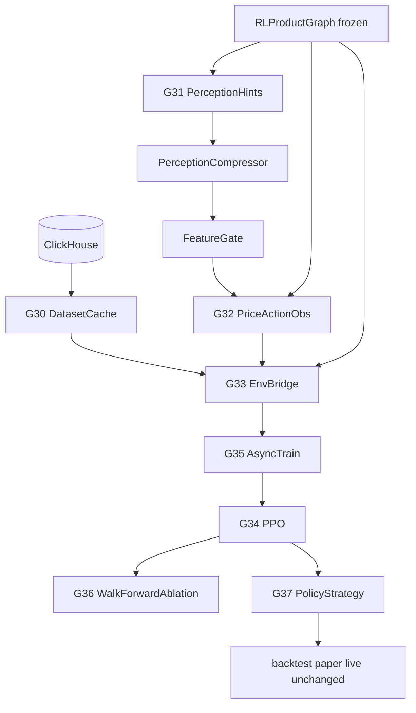

# RL Product Layer G30–G37 — Production Spec (Price-Action-First)

**North Star:** Agent learns OHLCV price action. RTM/SMC/ICT = weak context hints only. Core G0–G29 frozen.

---

## 0. Constraints

| Rule | Enforcement |
|------|-------------|
| Core immutable | No edits to `core/`, `bootstrap` ETL, existing `platform.*`, engines |
| Additive only | `quant_platform/rl_product/` + `quant_platform/plugins/rl/` + registry entries |
| Backward compat | `pytest tests -q` green every gate |
| Data | ClickHouse OHLCV only; synthetic unit tests only |
| No per-step DB | Episode loaded once at `reset()`; `EpisodeCursor` in RAM |
| No lookahead | `bars[0:t+1]` only; `test_no_lookahead.py` |
| No runtime discovery | `RLProductGraph.compile()` once at startup |

---

## 1. Architecture (G30–G37)



### Gate map

| Gate | Module | Plugins |
|------|--------|---------|
| G30 | `rl_product/dataset/` | `training_dataset`, `episode_cache` |
| G31 | `rl_product/perception/` | `rtm_*`(4), `smc_*_prob`(4), `ict_*`(3), `perception_compressor`, `feature_gate` |
| G32 | `rl_product/observation/` | `price_action_observation` |
| G33 | `rl_product/env/` | `rl_env_spot`, `rl_env_futures`, `execution_model` |
| G34 | `rl_product/agent/` | `ppo_torch` |
| G35 | `rl_product/training/` | `online_training` |
| G36 | `rl_product/evaluation/` | `walk_forward_rl_eval`, `ablation_eval` |
| G37 | `rl_product/inference/` | `policy_inference`, `policy_strategy` (+ `platform.strategies` entry) |

**Registry:** single group `platform.rl`. Deploy hook: `policy_strategy` also registers under `platform.strategies`.

---

## 2. Plugin tree

```
quant_platform/rl_product/
├── registry.py              # RL_GROUP = "platform.rl"
├── graph.py                 # RLProductGraph (frozen)
├── protocols.py             # v1.0 protocols
├── dataset/                 # G30
├── perception/              # G31
├── observation/             # G32
├── env/                     # G33
├── agent/                   # G34
├── training/                # G35
├── evaluation/              # G36
├── inference/               # G37
└── pipeline.py

quant_platform/plugins/rl/   # one folder per plugin
```

---

## 3. Observation (price-action-first)

### 3.1 Block budget (enforced in code)

| Block | Default dims (obs=128) | Min ratio | Content |
|-------|------------------------|-----------|---------|
| **price_action** | 90 | **≥70%** | OHLCV window + log returns + realized vol + volume delta |
| **context** | 16 | ≤25% | PerceptionCompressor output (gated) |
| **portfolio** | 14 | ~11% | position, equity_norm, uPnL, margin, dd, exposure |
| **reserved** | 8 | — | schema v1 padding / multi-TF hook |

**Validator:** `PriceActionObservationBuilder.validate_budget()` raises if `price_dims < 0.70 * obs_dim`.

### 3.2 Context dim (UPDATE)

```yaml
observation:
  dim: 128
  context_dims: 16          # default
  context_dims_max: 32        # hard cap in schema validator
  price_action_min_ratio: 0.70
  schema_version: "1.0"
```

- `context_dims` configurable **16 → 32** (future-proof)
- Default **16**
- Context **never** exceeds 25% of `obs_dim`
- **No raw price levels** in context block (bounded [0,1] / [-1,1] only)

### 3.3 Network (split-trunk — prevents context dominance)

```
price_trunk:   [256, 128]  ← primary capacity
context_trunk: [32, 16]   ← narrow; zeros when master_gate=0
portfolio_trunk: [32, 16]
→ concat → policy_head, value_head
```

---

## 4. Feature system (RTM / SMC / ICT)

### 4.1 Rules

| MUST | MUST NOT |
|------|----------|
| Perception hints only | Trading signals |
| Bounded [0,1] probabilistic | Raw zone prices in obs |
| PerceptionCompressor output | Direct reward driver |
| FeatureGate + ablation | Indicator-triggered actions |
| Timestamp-safe `bars[0:t+1]` | Lookahead |

### 4.2 Pipeline

```
11 hint plugins → DataEnvelope each
  → PerceptionCompressor(context_dims ∈ [16,32])
  → FeatureGate(master_gate, gate_smc, gate_rtm, gate_ict)
  → context block in obs
```

### 4.3 Compressor slots (default 16; extend to 32)

| Idx | Family | Fields |
|-----|--------|--------|
| 0–3 | SMC | bos_p, choch_p, ob_validity, fvg_fill_p |
| 4–7 | RTM | sd_strength, sweep_p, compression_p, flip_p |
| 8–11 | ICT | session_p, killzone_p, premium_discount, tod_norm |
| 12–15 | Meta | regime_vol, trend_persist, hint_entropy, gate_mask |
| 16–31 | Reserved | optional expansion when context_dims=32 |

### 4.4 Feature isolation (tests + ablation)

- `test_no_raw_levels_in_context.py` — reject envelopes with absolute prices in context path
- `test_context_gate_zeros_block.py` — master_gate=0 → context block all zeros
- G36 ablation **mandatory** before deploy:
  - **A:** `master_gate=0` (price-only baseline)
  - **B:** `master_gate=1` (full hints)
  - **C:** per-family gate sweeps
- Production rule: if OOS(B) ≈ OOS(A) → deploy with `master_gate=0`

---

## 5. Action space

```yaml
action:
  mode: continuous          # default
  range: [-1.0, 1.0]        # target exposure
  max_position: 1.0
  risk_scale: true          # post-policy; from portfolio/vol only
```

**Discrete optional:** flat | long_25 | long_100 | short_25 | short_100 (futures)

**Forbidden:** actions tied to BOS/FVG/RTM events or `strategy_signals`.

---

## 6. Execution model (MVP + pluggable)

### 6.1 Interface (upgrade-ready)

```python
class ExecutionModelProtocol(Protocol):
    def simulate_fill(
        self, target_exposure, price, position, bar_volume, *, config
    ) -> FillResult: ...
```

### 6.2 MVP impl: `simple_execution`

| Param | Default |
|-------|---------|
| fee_bps | 10 |
| spread_bps | 5 |
| slippage_bps | 3 × \|Δposition\| |
| partial_fill | false (fill_ratio=1.0) |

### 6.3 Future slot (not G30–G37)

- `orderbook_execution` plugin — same protocol, swap via config
- **Same plugin config** referenced in train / backtest / paper / live

Execution affects **PnL only** — not observation hints.

---

## 7. Reward (strict)

```python
r_pnl = realized_pnl_step / initial_equity                    # PRIMARY
r_risk = w_dd * drawdown_pen + w_sharpe * sharpe_component    # SECONDARY
r_ctx = context_alignment * context_gate                    # OPTIONAL TERTIARY

# context_alignment > 0 ONLY IF step_pnl > 0 AND hint_conf > threshold
# HARD CAP: context_reward_weight <= 0.08 (schema rejects > 0.08)

reward = clip(normalize(r_pnl + r_risk + r_ctx), -5σ, +5σ)
```

```yaml
reward:
  drawdown_penalty_weight: 0.15
  sharpe_component_weight: 0.10
  max_context_reward_weight: 0.05   # absolute max 0.08
  normalize: true                     # running mean/std
  clip_sigma: 5.0
```

**Unit test:** `context_gate=0` ∧ `max_context_reward_weight=0` → reward = f(PnL, risk) only.

---

## 8. PPO / training (production-safe)

### 8.1 Mandatory stabilizers

| Technique | Config | Gate |
|-----------|--------|------|
| Advantage normalization | per batch, mandatory | G34/G35 |
| Reward normalization | running mean/std | G35 |
| Reward clipping | ±5σ | G35 |
| Gradient clipping | max_grad_norm=0.5 | G34 |
| Entropy annealing | 0.01 → 0.001 linear | G35 |
| GAE | γ, λ configurable | G34 |
| Clipped surrogate | ε=0.2 | G34 |

### 8.2 Non-stationary + sparse reward handling

- Walk-forward folds (G36) — no single-regime overfit
- Reward normalization **per fold reset**
- Entropy floor (min 0.0005) — avoid premature collapse in sparse regimes
- Optional `reward_scale` warmup (first N steps excluded from norm stats)
- Episode-level min trades metric logged (detect no-trade collapse)

### 8.3 Training loop (G35)

```
startup:
  RLProductGraph.compile(config)     # once
  EpisodeCache.init(prefetch=2)
  RewardNormalizer.reset()

loop:
  rollouts = AsyncRolloutCollector.collect(n_steps)
  advantages = GAE(rollouts); normalize(advantages)   # mandatory
  PPO.update(rollouts, advantages)                  # grad clip + entropy schedule
  log: reward, loss, entropy, dd, win_rate, action_entropy
  checkpoint every N episodes + best OOS
```

**CLI:** `quant-train train --config config/training/<name>.yaml`

### 8.4 RLProductGraph phases (deterministic)

```
PERCEPTION → OBSERVATION → REWARD   (per env step, frozen handlers)
```

No plugin resolution inside loop.

---

## 9. Evaluation + deploy (G36–G37)

### G36
- Walk-forward: min 4 folds, OOS Sharpe, max DD, win rate
- Ablation A/B/C (required)
- Deterministic episode replay test (same seed → same obs sequence)

### G37
- `policy_inference` — load checkpoint, schema hash check
- `policy_strategy` — `StrategyProtocol.on_bar` → obs → policy → action
- Engines **unchanged** — backtest / paper / live consume strategy plugin only
- Train/deploy **RLProductGraph hash must match**

---

## 10. Risk controls

| Risk | Control |
|------|---------|
| Lookahead | Cursor + tests |
| Per-step DB | EpisodeCache + test |
| Context dominance | 70% price budget + narrow trunk + gate |
| Indicator overfit | Ablation A mandatory; cap context dims |
| Reward hacking | ctx weight ≤0.08; PnL>0 gate |
| Train/serve skew | Same graph compile path + schema hash |
| Execution mismatch | Shared ExecutionModelProtocol config |
| Feature leakage | No raw levels in context; isolation tests |
| Non-stationarity | Walk-forward + fold-wise norm reset |

---

## 11. Minimal config schema

```yaml
training:
  symbol: BTCUSDT
  timeframe: 1h
  market: spot                    # spot | futures
  episode_length: 500
  train_start: "2022-01-01"
  train_end: "2024-06-30"

observation:
  dim: 128
  window: 64
  price_action_min_ratio: 0.70
  context_dims: 16
  context_dims_max: 32
  schema_version: "1.0"

perception:
  master_gate: 1.0
  gate_smc: 1.0
  gate_rtm: 1.0
  gate_ict: 1.0

action:
  mode: continuous
  max_position: 1.0

execution:
  model: simple_execution         # future: orderbook_execution
  fee_bps: 10
  spread_bps: 5
  slippage_bps: 3

reward:
  max_context_reward_weight: 0.05
  drawdown_penalty_weight: 0.15
  sharpe_component_weight: 0.10
  normalize: true
  clip_sigma: 5.0

agent:
  algorithm: ppo
  price_trunk_hidden: [256, 128]
  context_trunk_hidden: [32, 16]
  learning_rate: 3.0e-4
  clip_ratio: 0.2
  gamma: 0.99
  gae_lambda: 0.95
  entropy_coef_start: 0.01
  entropy_coef_end: 0.001
  entropy_coef_min: 0.0005
  max_grad_norm: 0.5
  total_timesteps: 2000000

evaluation:
  walk_forward_folds: 4
  ablation_runs: [price_only, full_context, gate_sweep]
  leakage:
    max_context_sharpe_uplift_pct: 15
    context_only_must_not_beat_baseline: true

training:
  curriculum:
    enabled: false              # optional G35 — low→high vol

deploy:
  live_approved: false
```

Validated via `schema_config` plugin (additive schema registration).

---

## 12. Implementation checklist per gate

### G30 — Dataset
- [ ] `fetch_klines_range(start, end)` additive to ClickHouse client
- [ ] `TrainingDatasetLoader`, `EpisodeBuilder`, train/val/test split
- [ ] `EpisodeCache` LRU + async prefetch
- [ ] Plugins: `training_dataset`, `episode_cache`
- [ ] Tests: mock CH + no per-step query test

### G31 — Perception
- [ ] 11 hint plugins (probabilistic, timestamp-safe)
- [ ] `PerceptionCompressor` (context_dims 16–32)
- [ ] `FeatureGate`
- [ ] Tests: no lookahead, no raw levels, bounded outputs

### G32 — Observation
- [ ] `PriceActionObservationBuilder` (70% price min)
- [ ] Fixed float32 vector, schema_version
- [ ] Plugin: `price_action_observation`
- [ ] Tests: budget validator, master_gate=0 zeros context

### G33 — Environment
- [ ] `ExecutionModelProtocol` + `simple_execution` MVP
- [ ] `RLEnvironmentBridge` spot + futures
- [ ] Gymnasium wrapper, reward engine
- [ ] `RLProductGraph` PERCEPTION/OBS/REWARD phases
- [ ] Tests: slippage applied, PnL-dominant reward

### G34 — Agent
- [ ] Split-trunk Actor-Critic PyTorch
- [ ] PPO: GAE, clip, advantage norm, grad clip
- [ ] Checkpoint + schema metadata
- [ ] Plugin: `ppo_torch`
- [ ] Tests: grad non-zero, checkpoint roundtrip, context trunk ablation

### G35 — Training
- [ ] `AsyncRolloutCollector`
- [ ] `RewardNormalizer` + clip ±5σ
- [ ] `EntropySchedule`
- [ ] `OnlineTrainingLoop` + `quant-train` CLI
- [ ] Plugin: `online_training`
- [ ] Tests: short train run, norm stats, no runtime discovery
- [ ] *(Optional)* `curriculum_scheduler` — low→high vol stages (config off by default)

### G36 — Evaluation
- [ ] Walk-forward RL eval
- [ ] Ablation A/B/C runner
- [ ] Deterministic replay test
- [ ] **Leakage tests:** context removal uplift cap + context-only must fail (§15.2)
- [ ] Plugins: `walk_forward_rl_eval`, `ablation_eval`

### G37 — Deploy
- [ ] `policy_inference`, `model_registry`
- [ ] `policy_strategy` → `platform.strategies`
- [ ] Graph hash parity train/deploy
- [ ] Tests: backtest hook without engine patch

---

## 13. Production readiness (live gate)

- [ ] Ablation A (price-only) stable
- [ ] OOS Sharpe > 0 on ≥2 folds
- [ ] Paper 7+ days clean
- [ ] `max_context_reward_weight ≤ 0.08`
- [ ] `deploy.live_approved: true` manual flag
- [ ] Same `execution.model` config train/paper/live
- [ ] Kill switch: `master_gate=0` tested

---

## 14. Additive registration (every gate)

- [ ] `quant_platform/registries/rl_product.py`
- [ ] `groups.py` → `ALL_REGISTRY_GROUPS`
- [ ] `pyproject.toml` entry points `platform.rl`
- [ ] `policy_strategy` entry in `platform.strategies`
- [ ] `docs/MIGRATION.md` section
- [ ] `tests/platform/rl_product/gXX/`
- [ ] Full suite green

**Never modify:** `quant_platform/core/`, existing domain plugins, `services/` workers, engine internals.

---

## 15. Live risk register (review notes — incorporated)

| Risk | Status now | Mitigation in plan |
|------|------------|-------------------|
| Context 32 dim too weak in news-driven regimes | Accepted for G30–G37 | Default 16; max 32; ablation proves marginal value; **future:** hierarchical context (§16) |
| PPO fragile (reward noise, regime shift) | Partially mitigated | Norm + clip + entropy + walk-forward; **optional:** curriculum (§15.1) |
| Execution too simple for real live | MVP explicit | `ExecutionModelProtocol` + `simple_execution`; upgrade slot (§16) |
| Context leakage / shortcut learning | Hardened in G36 | Ablation A/B + **leakage tests** (§15.2) |
| Train/deploy skew | Covered | Schema hash parity + deterministic replay + frozen graph |

### 15.1 Optional — curriculum training (G35, not blocking MVP)

Config-gated; default **off**.

```yaml
training:
  curriculum:
    enabled: false
    stages:
      - name: low_vol
        vol_percentile_max: 33
        timesteps: 500000
      - name: mid_vol
        vol_percentile_max: 66
        timesteps: 500000
      - name: full
        timesteps: 1000000
```

- Episodes filtered by rolling ATR percentile at dataset load time (no new DB query)
- Reduces early PPO collapse in high-noise crypto regimes
- Plugin hook: `curriculum_scheduler` under `platform.rl` (optional G35 add-on)

### 15.2 Mandatory — context leakage hardening tests (G36)

Add to `ablation_eval` plugin:

| Test | Pass criteria |
|------|---------------|
| **Context removal drop** | Train A (price-only) vs B (full); require `OOS(B) - OOS(A) < X%` where default `X=15%` Sharpe uplift cap — if context adds >15%, investigate leakage |
| **Context-only failure** | Train with `price_action_min_ratio: 0` (context+portfolio only, test mode); OOS Sharpe must be **≤ 0** or max DD **> 2×** price-only baseline — proves hints are not standalone alpha |
| **Context-only no-trade** | Action entropy collapse or trade count < 5% of price-only — secondary signal |

Config:

```yaml
evaluation:
  leakage:
    max_context_sharpe_uplift_pct: 15
    context_only_must_not_beat_baseline: true
```

---

## 16. Future roadmap (post G37 — do NOT implement now)

| Item | Trigger | Direction |
|------|---------|-------------|
| Hierarchical context | context_dims=32 insufficient in ablation | Multi-scale compressor: micro (bar) + meso (session) + macro (regime); or attention pooling over hint envelopes — **not flat 64+ vector** |
| Order book execution | paper/live slippage mismatch > threshold | `orderbook_execution` plugin implementing `ExecutionModelProtocol` |
| Latency model | live co-location deploy | `latency_execution` plugin slot |
| SAC / offline RL | PPO unstable on target symbol | Second agent plugin; same obs/reward contract |

---

## 17. Design validation (architecture review)

| Dimension | Assessment |
|-----------|------------|
| Architecture vs institutional RL engine | ~85–90% aligned (frozen graph, schema parity, episode cache, plugin isolation) |
| Production implementability | High — gated commits, additive registry, existing engine deploy path |
| ML thesis | Correct: **price action = backbone; context = noise-aware hint** |

**Institutional-grade elements already in spec:** schema hash train/deploy, deterministic replay, no runtime discovery, walk-forward + ablation before live.

